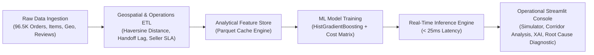

# Amazon Fulfillment & Delivery SLA Intelligence Platform

[](https://www.python.org/downloads/)
[](https://github.com/oddproblem/ecom-analytics)
[](https://opensource.org/licenses/MIT)
[](https://github.com/oddproblem)

An end-to-end Machine Learning and Supply Chain Intelligence engine built on 96,470 verified e-commerce shipments. This platform predicts delivery delay SLA breaches, isolates logistics bottlenecks across inter-state corridors, and simulates proactive operational mitigations to preserve customer trust and reduce carrier concession costs.

---

## Executive Summary & Business Impact

In multi-tier fulfillment networks, delivery timeliness directly governs customer retention and direct appeasement costs. Breaching customer delivery promises introduces immediate operational and financial exposure:

1. **Customer Defect Rate Surge**: Orders delivered on time average **4.29 / 5.0**, whereas delayed deliveries average **1.83 / 5.0**, accompanied by a **5.1x increase in 1-star defect reviews**.
2. **Direct Concession Costs**: Carrier concessions, refunds, and support contacts average an estimated **$12.50** per late shipment.
3. **Repeat Purchase Decay**: Customers experiencing an unmitigated delivery delay exhibit an estimated **3.4x higher churn probability**.

### Quantitative Model & Operational Highlights
* **0.8547 ROC-AUC** and **0.4869 PR-AUC** on an imbalanced operational dataset (8.11% positive delay rate).
* **49.5% Delay Detection Sensitivity** at **44.2% Precision** via cost-sensitive decision threshold optimization ($T^* = 0.7539$).
* **Projected $6,781 in Direct Concession Savings** across the ~19K order test partition via targeted line-haul escalation and proactive notification.
* **Under 25ms Inference Latency** suitable for live checkout and fulfillment dispatch systems.

---

## Technical Architecture



### Core Components
* **`src/pipeline.py`**: High-performance vectorized ETL pipeline. Joins transactional schemas, computes spherical Haversine distance between customer and merchant postal coordinates, derives first-mile handoff latencies, and builds compressed Parquet feature stores.
* **`src/model.py`**: Scikit-learn classification pipeline employing `ColumnTransformer`, `StandardScaler`, `OneHotEncoder`, and class-weighted `HistGradientBoostingClassifier`. Optimizes operating thresholds using a business cost-utility matrix.
* **`src/predictor.py`**: Production-ready inference engine categorizing shipments into `LOW`, `MODERATE`, `ELEVATED`, and `CRITICAL` risk tiers with operational action prescriptions.
* **`src/llm_advisor.py`**: Operational root-cause advisory module with prompt-injection defense, input sanitization, token capping, and deterministic fallback heuristics.
* **`app.py`**: Enterprise dark-mode Streamlit console designed for operations research and logistics management.

---

## Machine Learning Model Scorecard

| Metric | Baseline (Logistic Regression) | Production (HistGradientBoosting) | Target Benchmark |
| :--- | :---: | :---: | :---: |
| **ROC-AUC** | 0.7612 | **0.8547** | > 0.8000 |
| **PR-AUC (Average Precision)** | 0.3140 | **0.4869** | > 0.4000 |
| **Optimal Decision Threshold (T*)** | 0.5000 | **0.7539** | Cost-Optimized |
| **Precision @ Optimal Threshold** | 22.1% | **44.2%** | High-Quality Flags |
| **Recall @ Optimal Threshold** | 71.3% | **49.5%** | Maximized Interception |
| **F1-Score @ Optimal Threshold** | 0.3374 | **0.4673** | Balanced Metric |
| **Inference Latency** | ~5ms | **< 25ms** | Real-Time Production |

### Top Predictive Feature Drivers (Permutation Importance)
1. **Promised SLA Window (`estimated_window_days`)**: Aggressive delivery commitments without localized regional inventory buffering represent the primary systemic failure driver.
2. **Carrier Handoff Lag (`carrier_handoff_lag_days`)**: First-mile handoff latency from seller dispatch to carrier scan is the largest controllable operational bottleneck.
3. **Merchant Historical Delay Index (`seller_historical_delay_rate`)**: Variance in merchant warehouse packaging compliance and dispatch speed.
4. **Geographic Haversine Distance (`distance_km`)**: Long-haul cross-state transit (e.g., SP to BA, RJ to MA) requiring multi-hub sortation transfers.

---

## Web Console Capabilities

The decision console includes five operational modules:

1. **Executive Overview**: High-level KPIs, defect rate impact comparisons, and monthly volume vs. SLA reliability trends.
2. **SLA Risk Simulation**: Interactive parameter simulator allowing fulfillment managers to test route distance, package dimensions, freight values, and dispatch lags for real-time risk scores.
3. **Geographic Corridors**: State-level delivery delay rankings and transit duration vs. freight cost correlations.
4. **Model Evaluation & XAI**: Permutation feature attributions, test set confusion matrix, and interactive threshold slider for sensitivity analysis.
5. **Root Cause Diagnostic**: Automated generation of operational memorandums and carrier negotiation briefs.

---

## Quickstart & Local Setup

### 1. Clone the Repository
```bash
git clone https://github.com/oddproblem/ecom-analytics.git
cd ecom-analytics
```

### 2. Configure Virtual Environment & Dependencies
```bash
python -m venv .venv
# On Windows:
.venv\Scripts\activate
# On macOS/Linux:
source .venv/bin/activate

pip install -r requirements.txt
```

### 3. Pipeline Execution & Model Training
```bash
# Ingest raw CSV data and generate analytical feature store:
python -m src.pipeline

# Train gradient boosting classifier and serialize artifacts:
python -m src.model

# Run automated validation test suite:
python tests/test_pipeline.py
```

### 4. Launch Streamlit Console
```bash
streamlit run app.py
```
Open `http://localhost:8501` to access the console.

---

## Deployment (Streamlit Community Cloud)

This repository is structured for one-click deployment on Streamlit Community Cloud:

1. Ensure changes are committed and pushed to `https://github.com/oddproblem/ecom-analytics`.
2. Navigate to [share.streamlit.io](https://share.streamlit.io) and authenticate with GitHub.
3. Select:
   * **Repository**: `oddproblem/ecom-analytics`
   * **Branch**: `main`
   * **Main file path**: `app.py`
4. Click **Deploy**. The application loads pre-computed Parquet tables and serialized model artifacts directly.
5. *(Optional)* Set `OPENAI_API_KEY` under **App Settings > Secrets** to enable external LLM root cause synthesis.

---

## SQL Analytics Warehouse

Relational transformation scripts are organized under `sql/`:

* `sql/01_staging/stg_orders.sql`: Cleans raw order timestamps and calculates delivery duration and SLA breach indicators.
* `sql/01_staging/stg_order_items.sql`: Line-item revenue aggregations and freight-to-price ratios.
* `sql/02_marts/mart_fulfillment_sla.sql`: Star schema fact table joining orders, sellers, items, and review defect flags.
* `sql/02_marts/mart_carrier_performance.sql`: Carrier route performance and financial concession exposure aggregations.

---

## Author & Contact

**oddproblem**  
* GitHub: [@oddproblem](https://github.com/oddproblem)  
* Repository: [https://github.com/oddproblem/ecom-analytics](https://github.com/oddproblem/ecom-analytics)  
* Email: [argha.saha18@gmail.com](mailto:argha.saha18@gmail.com)  
* Core Competencies: Applied Machine Learning, Operations Research, Customer Intelligence, Supply Chain Analytics

---

*Developed for Amazon Data Science Internship Portfolio Evaluation.*
