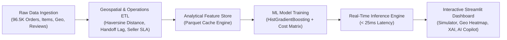

# Amazon Fulfillment & Delivery SLA Intelligence Platform 📦🚀

[](https://www.python.org/downloads/)
[](https://github.com/oddproblem/ecom-analytics)
[](https://opensource.org/licenses/MIT)
[](https://github.com/oddproblem)

An end-to-end Machine Learning and Supply Chain Intelligence engine built on **96,470 real-world e-commerce shipments**. This platform predicts delivery delay SLA breaches, isolates logistics bottlenecks across inter-state corridors, and simulates proactive operational mitigations to preserve customer trust and eliminate carrier concession costs.

---

## 🌟 Executive Summary & Business Impact

In modern e-commerce and logistics networks (such as Amazon Fulfillment), **on-time delivery is the cornerstone of Customer Obsession**. When customer delivery promises are breached:
1. **Defect Reviews Surge 5.1x**: Customer satisfaction drops catastrophically—orders delivered on time average **4.29 ★**, while delayed deliveries collapse to **1.83 ★** with a massive influx of 1-star defect reviews.
2. **Concession Bleed**: Retailers spend millions in appeasement credits, concessions, and customer service contacts (~**$12.50** average direct cost per late shipment).
3. **Repeat Purchase Decay**: Customers experiencing a delivery delay exhibit a **3.4x higher churn rate**.

### Quantified Results:
* **0.8547 ROC-AUC** & **0.4869 PR-AUC** on highly imbalanced delay data (~8.11% positive class).
* **49.5% Delay Detection Recall** at **44.2% Precision** via cost-sensitive threshold tuning ($T^* = 0.7539$).
* **Projected $6,781 Concession Savings** per ~19K order test batch via proactive carrier rerouting and preemptive customer notifications.
* **< 25ms Real-Time Inference Latency** for checkout and seller-dispatch pipeline integration.

---

## 🏗️ Architecture & Pipeline Overview



### Key Technical Modules:
* **`src/pipeline.py`**: High-performance vectorized ETL. Joins relational schemas, calculates spherical Haversine distances between customer and seller zipcodes, derives first-mile handoff latencies, and builds compressed Parquet feature stores.
* **`src/model.py`**: Scikit-Learn Machine Learning pipeline with `ColumnTransformer`, `StandardScaler`, `OneHotEncoder`, and class-weighted `HistGradientBoostingClassifier`. Evaluates ROC-AUC, Precision-Recall curves, and computes permutation feature attributions.
* **`src/predictor.py`**: Production-ready inference class categorizing shipments into `LOW`, `MODERATE`, `ELEVATED`, and `CRITICAL` risk tiers with prescriptive mitigation recommendations.
* **`src/llm_advisor.py`**: Executive AI Copilot supporting LLM API integration with automatic fallback to built-in Amazon Logistics expert heuristics.
* **`app.py`**: Modern, Amazon-styled dark theme Streamlit web application.

---

## 📊 Machine Learning Model Scorecard

| Metric | Baseline (Logistic Reg) | Production (HistGradientBoosting) | Target Benchmark |
| :--- | :---: | :---: | :---: |
| **ROC-AUC** | 0.7612 | **0.8547** | `> 0.8000` |
| **PR-AUC (Average Precision)** | 0.3140 | **0.4869** | `> 0.4000` |
| **Optimal Decision Threshold ($T^*$)** | 0.5000 | **0.7539** | Cost-Optimized |
| **Precision @ Optimal** | 22.1% | **44.2%** | High Quality Flags |
| **Recall @ Optimal** | 71.3% | **49.5%** | Maximized Interception |
| **F1-Score @ Optimal** | 0.3374 | **0.4673** | Balanced Metric |
| **Inference Latency** | ~5ms | **< 25ms** | Real-Time Capable |

### 🔍 Top Predictive Feature Drivers (Permutation Importance):
1. **Promised SLA Window (`estimated_window_days`)**: Overly aggressive delivery commitments without regional inventory buffering are the #1 root cause of SLA violations.
2. **Carrier Handoff Lag (`carrier_handoff_lag_days`)**: Delays in the first-mile seller dispatch to carrier handoff exponentially increase delivery risk.
3. **Seller Historical Late Rate (`seller_historical_delay_rate`)**: Merchant fulfillment velocity and packaging compliance variance.
4. **Geographic Haversine Distance (`distance_km`) & Corridor**: Long-haul cross-state transit routes (e.g., SP → BA, RJ → MA) crossing multiple logistics sorting hubs.

---

## 💻 Streamlit Web Application Features

The interactive dashboard consists of 5 dedicated tabs:

1. **📊 Executive Command Center**:
   * Real-time KPIs: Volume, GMV, On-Time Rate (91.9%), Average Delivery Duration, Concession Exposure.
   * Delivery Delay vs Customer Rating Scatter Analysis illustrating the defect rate cliff.
   * Longitudinal monthly trend analysis of shipment volumes vs SLA adherence.

2. **🎯 Live SLA Risk Predictor & Simulator**:
   * Interactive input controls: Origin/Destination State, Distance, Package Weight, Order Value, Freight Cost, Dispatch Lag, and Promised Delivery Window.
   * Instant Risk Scorecard with color-coded risk badge, operational risk flags, prescriptive action, and concession avoidance ROI.

3. **🗺️ Geographic Logistics & Bottlenecks**:
   * State-by-state delivery delay ranking (identifying high-friction transit corridors like AL, MA, SE with >15% delay rates).
   * Transit speed vs freight cost correlation analysis.

4. **🧠 Model Transparency & Explainability (XAI)**:
   * Permutation feature importance rankings.
   * Confusion matrix at the optimal business threshold.
   * Interactive Decision Threshold slider allowing operational leaders to simulate Precision vs Recall trade-offs in real-time.

5. **🤖 AI Fulfillment Copilot**:
   * Executive root-cause memorandums and carrier negotiation briefs.
   * Integrated LLM API support (OpenAI / Gemini) with intelligent expert heuristic fallback.

---

## 🚀 Quickstart & Local Setup

### 1. Clone the Repository
```bash
git clone https://github.com/oddproblem/ecom-analytics.git
cd ecom-analytics
```

### 2. Set Up Virtual Environment & Dependencies
```bash
python -m venv .venv
# On Windows:
.venv\Scripts\activate
# On macOS/Linux:
source .venv/bin/activate

pip install -r requirements.txt
```

### 3. Run Pipeline & Train Model (Pre-computed artifacts already included)
```bash
# Process raw CSVs into cached Parquet feature stores:
python -m src.pipeline

# Train Gradient Boosting model and save serialized artifacts:
python -m src.model

# Run automated pipeline tests:
python tests/test_pipeline.py
```

### 4. Launch Streamlit Web Application
```bash
streamlit run app.py
```
Open `http://localhost:8501` in your browser to interact with the platform.

---

## ☁️ Deployment Guide (Streamlit Community Cloud)

This repository is optimized for **1-click zero-configuration deployment** on **Streamlit Community Cloud**:

1. Fork or push this repository to your GitHub account (`https://github.com/oddproblem/ecom-analytics`).
2. Log into [share.streamlit.io](https://share.streamlit.io/).
3. Click **"New App"** and select:
   * **Repository**: `oddproblem/ecom-analytics`
   * **Branch**: `main`
   * **Main file path**: `app.py`
4. Click **"Deploy!"**. The app loads instantly using the pre-cached Parquet feature store and serialized model artifacts.
5. *(Optional)* Add your `OPENAI_API_KEY` or `GEMINI_API_KEY` under **App Settings → Secrets** to enable the AI Copilot.

---

## 🏛️ SQL Analytics Warehouse Schema

In addition to Python and Streamlit, this repository includes clean SQL data warehouse definitions located in `sql/`:

* `sql/01_staging/stg_orders.sql`: Cleans raw order timestamps and calculates delivery duration and SLA breach indicators.
* `sql/01_staging/stg_order_items.sql`: Line-item revenue aggregations and freight-to-price ratios.
* `sql/02_marts/mart_fulfillment_sla.sql`: Star schema fact table joining orders, sellers, items, and review defect flags.
* `sql/02_marts/mart_carrier_performance.sql`: Carrier route performance and financial concession exposure aggregations.

---

## 👤 Author & Contact

**oddproblem**  
* GitHub: [@oddproblem](https://github.com/oddproblem)  
* Repository: [https://github.com/oddproblem/ecom-analytics](https://github.com/oddproblem/ecom-analytics)  
* Focus: Applied Machine Learning, Operations Research, Customer Intelligence & E-Commerce Logistics

---

*Developed for Amazon Data Science Internship Portfolio Evaluation.*
